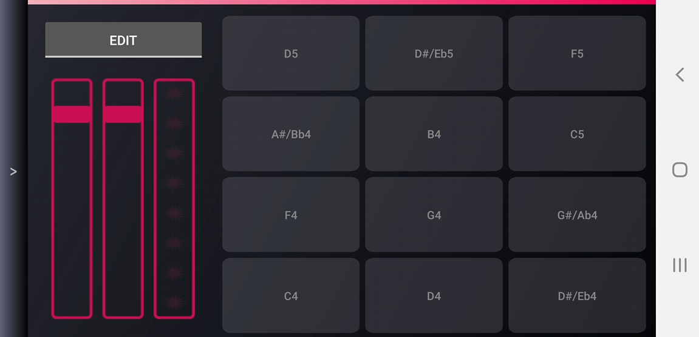
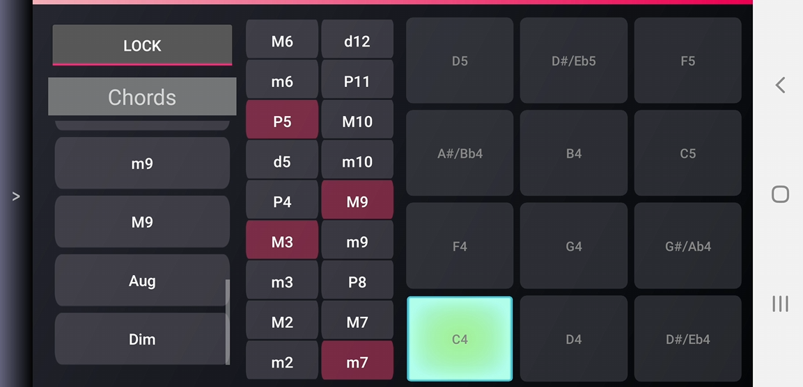
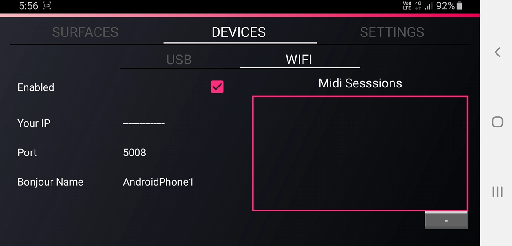
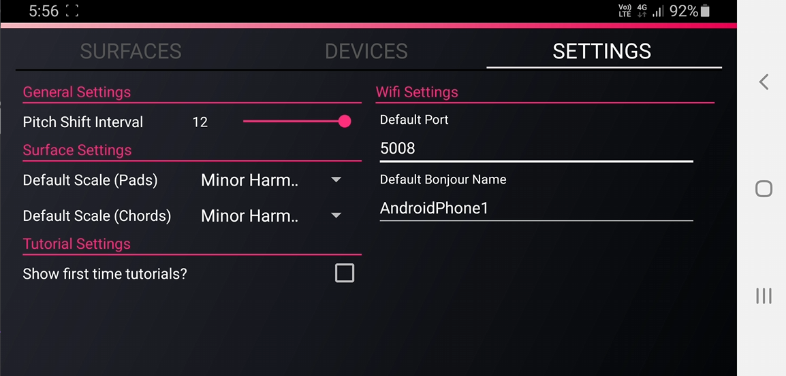

Disclaimer: This is not a full working upload of the app. Certain parts of the code (and project/environment files) have been left out as the project is/was in use commercially. 

<h1>Midi App for Android</h1>

<h2>Description</h2>
<b>What is MIDI?</b>  
MIDI is a format for sending packets of information to a DAW (desktop audio workstation). MIDI does not contain any sounds itself rather it defines signals on note duration, pitch and velocity.  
For example when I press a key it would send "Start playing this note" and when I release the key it sends "Stop playing this note" message. You can also control other parameters which can be bound to different signals. For example I can bind a dial to the volume or the filter of a low pass filter so when I adjust the dial it will appropriately adjust those parameters in the software.  
See more here: https://en.wikipedia.org/wiki/MIDI  

<h3>RTP-MIDI</h3>
This app supports the RTP-MIDI protocol which allows sending MIDI packets over ethernet and wifi. This requires the RTP-MIDI driver to be installed on windows (I believe it comes natively with Apple).  
I implemented this protocol myself in android as there was no native implementation for it at the time of building (code in MidiAPp/Midi/RTP)  
See more here: https://en.wikipedia.org/wiki/RTP-MIDI

<h2>App Screens</h2>
<h3>Pad View</h3>
This is a straightforward pad layout for playing. It has two sliders which can be bound to anything and includes a pitch bend slider also. The slide-out window allows you to change the base key and scale for the pads.

<h3>Piano View</h3>
This is a basic piano view containing a single bindable dial and pitchbend slider. It also has the slide-out window to allow changing base key and scale.

<h3>Chord View</h3>

The chord view is similar to the pad view however each button can send multiple notes at once. 

 
You can press edit and change the exact intervals sent for each pad to allow different types of chords to be played by each pad.   

 
 
The same slide-out is available for this view also. 

<h3>Devices</h3>

This app supports two connection methods: USB and Wifi (RTP-MIDI protocol). 

<h3>Settings</h3>

